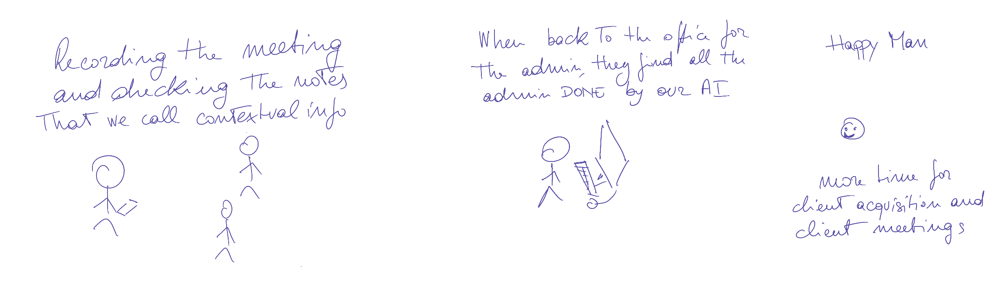

# Multi-purpose meeting assistant - MPMA

The MPMA is an AI assistant that when activated, listens to your conversation. It pulls contextual information and tracks your discussion points in real time. At the end of the recording, the recorded transcipt is turned into reports and actions such as emails and calendar invites. 

It performs the role of an assistant.

## What is it

The service is made of the following parts:
- a listening system such as a recording app and a online meeting bot
- a real time audio to transcript service
- a real time transcript to knowledge base provider
- a web-based admin dashboard
- a set of API connections to external providers


## UX



### Meeting UX
- The user receives a notification, their calendar indicates a meeting is starting in 5 minutes.
- The user opens the notification, which will open then app, where the user will find a button - start the recording. The user clicks on the button to start the recording.

- The user can check the screen to access contextual information.
- The user can talk to the assistant to provide specific contextual data.
- The user can scroll through the discussion points discussed during the meeting.
- If the meeting was a "labelled" meeting, the user can access the label-specific real time data - such as a discussion points they should treat and not have treated yet.

- Once the meeting is completed the user can switch off the recording.

### Initial setup and onboarding


- The user accesses the web-based admin dashboard to subscribe to the service.

- The user starts the onboarding process with a short description / video of how the MPMA works.
- The user is asked if they want to connect the calendar.
- The user is asked to download the app and try to record an audio (ideally should receive an email with the app download link)
- The user downloads the app, signs in, and starts a first meeting.
- The user is welcomed in the app with a greeting in the contextual notes and the user is asked to stop the recording and to go back to the dashboard.
- The user goes back to the dashboard where the onboarding is finished.

- The user is not in the main dashboard and can see they just finished a meeting and a transcript is available.
- Next to the meeting details the user can see there is a button that implies "there are things to complete/review/available for you"
- When the user clicks on it can see the specific meeting screen where on the right there is a column with the transcript and the recorded audio. On the left a column with a list of actions available to the user. The actions are a list of automatically created actions from AI and a request for custom actions.


- The first automatic action is to send yourself an email, the dashboard displays the draft email that the user can modify and send.

- The user going back to the dashboard can see the meetings in the calendar popping up in the section called "Next meetings".
- The user can see a highlights button that says Create templates.

- When the user clicks on Create template for the first time, a onboarding process starts to explain the create templates feature.


### Create template onboarding
- The user is explained that here they can create a template to automate the creation of emails and reports. The first step is to paste an "old" email or report that will be used to create a template.
- The user copies an old email and pastes it.
- The user is displayed the same email but many parts of the email are blank spaces. These are the main spaces where the AI will include (but not exclusively) the meeting/client specific content.

- The user can amend or name and save the [email] template


## Architecture


- FE app
- FE admin dashboard

- BE audio streaming service.
- BE meeting bot.
- BE text streaming service.

- BE AI LLM services.
- BE login service.
- BE client info service.
- BE external data service.
- BE calendar connections service.
- BE other CMS connection service.
- BE email connection service.


## MVP

- FE app that records audio and streams it to the BE. An iOS app with a login system and way to record audio, stream it to the BE, and receive a stream of text (Transcript and Contectual data types).
- BE auth system.
- BE receives the BE, sends it to ElevenLabs to get a stream of text.
- BE to send the text stream to the FE app.
- BE to pick direct orders to check a Scraping API or a database (i.e. if the transcript contains the word "abc find me the last investments of Elon Musk").
- BE to stram the contextual info.
- FE to receive and display the contextual info.

- FE2 of an admin dashboard where the recorded transcripts can be checked and where a couple of reports are displayed.


## Initial Data Structures
   ```javascript
type UserProfile = {
   id:string;
   name: string;
   surname?: string;
   email: string;
}

type Company = { //is it needed?
   id:string;
   name:string;
}

type Meeting = {
   id:string;
   userId:string;
   title:string;
   date:string;
   timeStartRecording:string;
   timeStopRecording:string;
   location:"FACE-TO-FACE" | "ZOOM" | "TEAMS" | "MEET";
   meetingType?:string;
}

type Transcript = {
   id:string;
   userId:string;
   meetingId:string;
   recordURL:string; // is the body of the transcript stored in a storage?
}

type Contextual = {
   id:string;
   userId:string;
   meetingId:string;
   data:string; // long string
}

type Template = {
   id:string;
   userId:string;
   data: Object;
   lastModified:string;
   creationDate:string;
}
   ```


## Get started

1. Install dependencies

   ```bash
   npm install
   ```

2. Start the app

   ```bash
    npx expo start
   ```

In the output, you'll find options to open the app in a

- [development build](https://docs.expo.dev/develop/development-builds/introduction/)
- [Android emulator](https://docs.expo.dev/workflow/android-studio-emulator/)
- [iOS simulator](https://docs.expo.dev/workflow/ios-simulator/)
- [Expo Go](https://expo.dev/go), a limited sandbox for trying out app development with Expo

You can start developing by editing the files inside the **app** directory. This project uses [file-based routing](https://docs.expo.dev/router/introduction).

## Get a fresh project

When you're ready, run:

```bash
npm run reset-project
```

This command will move the starter code to the **app-example** directory and create a blank **app** directory where you can start developing.

## Learn more

To learn more about developing your project with Expo, look at the following resources:

- [Expo documentation](https://docs.expo.dev/): Learn fundamentals, or go into advanced topics with our [guides](https://docs.expo.dev/guides).
- [Learn Expo tutorial](https://docs.expo.dev/tutorial/introduction/): Follow a step-by-step tutorial where you'll create a project that runs on Android, iOS, and the web.

## Join the community

Join our community of developers creating universal apps.

- [Expo on GitHub](https://github.com/expo/expo): View our open source platform and contribute.
- [Discord community](https://chat.expo.dev): Chat with Expo users and ask questions.
